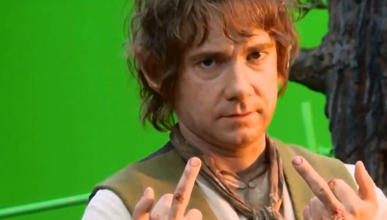
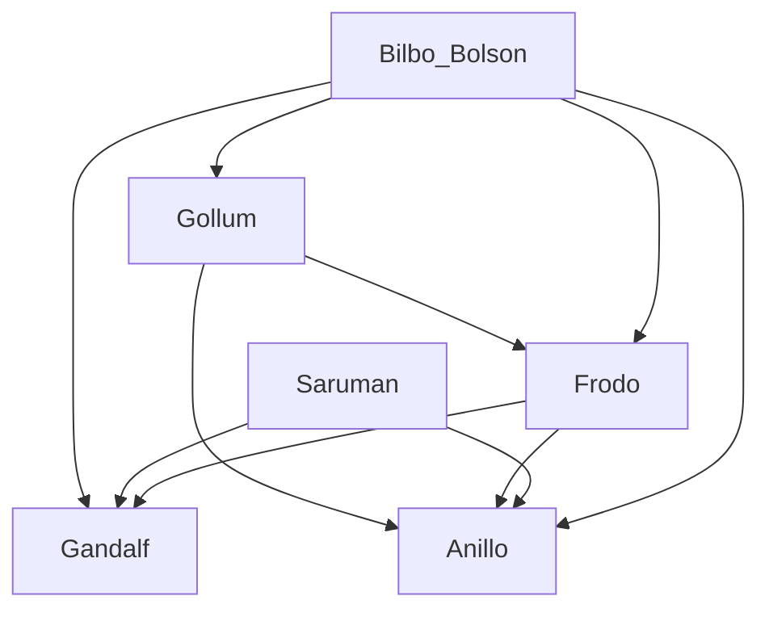

# El titular mas grande 

Este readme se ha basado en el tutorial por pasos de [GitHub](https://docs.github.com/es/get-started/writing-on-github/getting-started-with-writing-and-formatting-on-github/basic-writing-and-formatting-syntax).
## segundo titular mas grande

### tercero

__negrita__ o **negrita**

*cursiva*

~~tachado~~

***negrita y cursiva***

> Texto que es una cita

Algunos tipos de listaje son:
```
este
este 
esta
```

El fondo del mar es #RRGGBB  





**Lista de perros simpaticos**

- todos
  - todos
- todos
  - todas


**Lista de morosos** 

1. Fernado LAgo
2. Alejandra Dom
3. Ange Sera
4. Rque Alv
5. Sara Rami

- [x] elemento marcado
- [ ] otra
- [ ] otro

Incluir emojis :cowboy_hat_face: , :+1:

Here is a simple flow chart:

